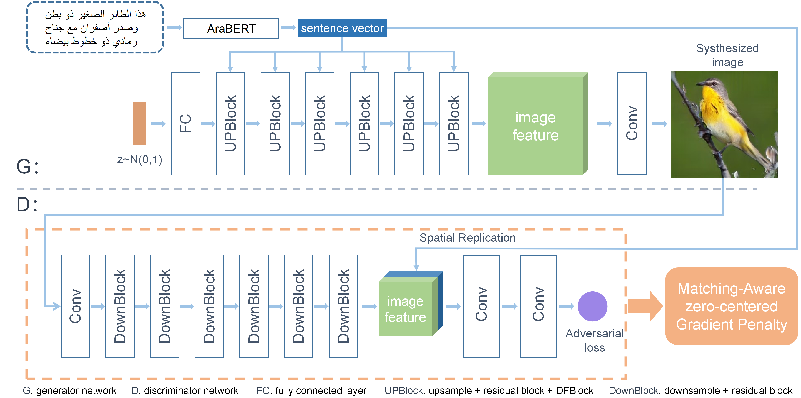

# ADF-GAN: Arabic Deep Fusion Generative Adversarial Networks for Text-to-Image Generation



---
### Requirements
- python 3.6+
- Pytorch 1.0+
- tensorflow-gpu  >= 1.11.0, <2.0 # GPU version of TensorFlow.
- easydict
- nltk
- scikit-image
- transformers
- PyArabic
- farasapy
- python-bidi
- arabic-reshaper
- tensorboard


### Installation
Clone this repo.
```
git clone https://github.com/BeboZaki/Arabic-text-visualization-using-ADF-GAN.git
cd Arabic-text-visualization-using-ADF-GAN/code/
```

### Datasets Preparation
1. Download the Arabic dataset for [CUB-200](https://drive.google.com/drive/folders/137IXPY0rpRAh9rCsQTKQesrZ4lvvn5mx?usp=sharing)

### Pre-trained text encoder
1. Download the [pre-trained text encoder](https://drive.google.com/file/d/17M9Xn5Nhk7DfMHY1_movO4MAw60UsvU1/view?usp=sharing) for CUB-200 and save it to `DAMSMencoders/CUB-200`

---
### Training
**Train ADF-GAN models:**
  - For CUB-200 dataset: `python main.py --cfg cfg/bird.yml`

- `*.yml` files are example configuration files for training/evaluation our models.

### Evaluating

**Dwonload Pretrained Model**
- [ADF-GAN for CUB-200](https://drive.google.com/file/d/14qv3kM-g0Hd1ZcfGlNyEnKAUUZhKr67u/view?usp=sharing). Download and save it to `models/CUB-200/`

**Evaluate ADF-GAN models:**

- To evaluate our ADF-GAN on CUB-200, change B_VALIDATION to True in the bird.yml. and then run `python main.py --cfg cfg/bird.yml`
- We compute inception score for models trained on CUB-200 using [StackGAN-inception-model](https://github.com/hanzhanggit/StackGAN-inception-model).
- We compute FID for CUB-200 using [DM-GAN/eval/FID](https://github.com/MinfengZhu/DM-GAN/tree/master/eval/FID). 

---
**Reference**
- [StackGAN++: Realistic Image Synthesis with Stacked Generative Adversarial Networks](https://arxiv.org/abs/1710.10916) [[code]](https://github.com/hanzhanggit/StackGAN-v2)
- [AttnGAN: Fine-Grained Text to Image Generation with Attentional Generative Adversarial Networks](https://openaccess.thecvf.com/content_cvpr_2018/papers/Xu_AttnGAN_Fine-Grained_Text_CVPR_2018_paper.pdf) [[code]](https://github.com/taoxugit/AttnGAN)
- [DM-GAN: Realistic Image Synthesis with Stacked Generative Adversarial Networks](https://arxiv.org/abs/1904.01310) [[code]](https://github.com/MinfengZhu/DM-GAN)
- [DF-GAN: Deep Fusion Generative Adversarial Networks for Text-to-Image Synthesis](https://arxiv.org/abs/2008.05865) [[code]](https://github.com/tobran/DF-GAN)
- [AraBERT: Transformer-based Model for Arabic Language Understanding](https://arxiv.org/abs/2003.00104) [[code]](https://github.com/aub-mind/arabert)
